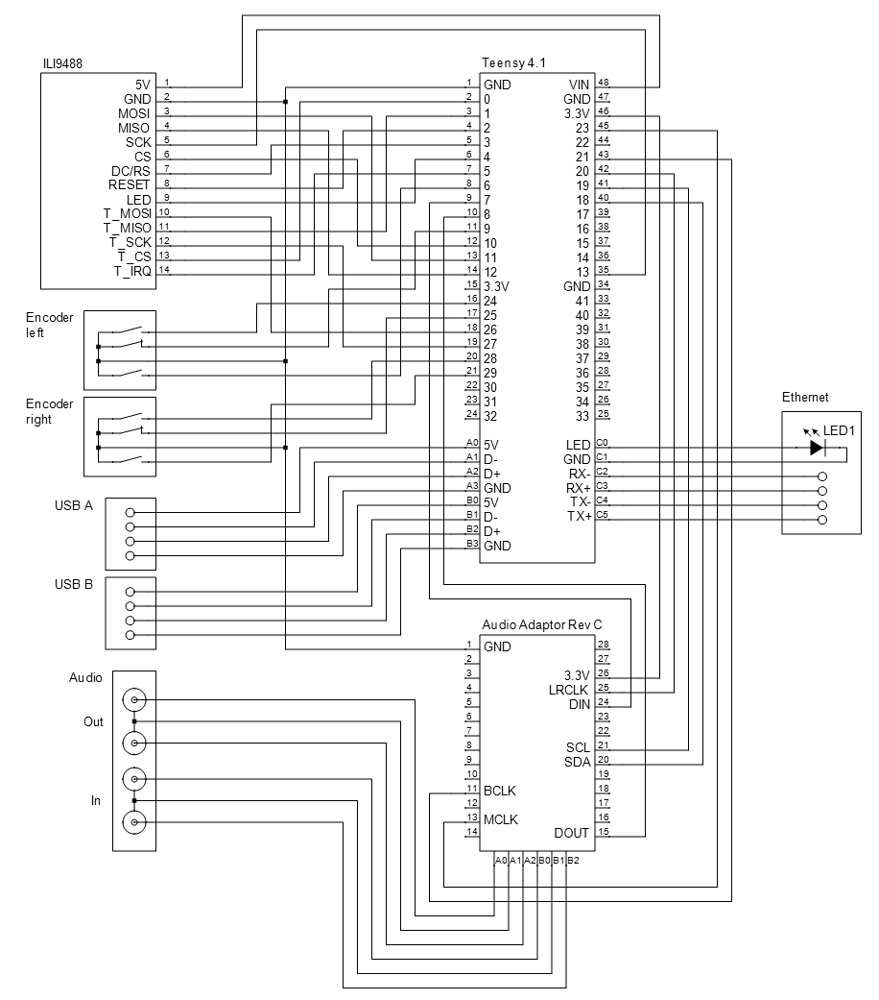

# hexaTron
Teensy 4.1 based polyphonic Synthesizer with Display
#### Features
#### GPIO I2S SGTL5000
* GPIO 7 - DIN (Headphone/Line-Out)
* GPIO 8 - DOUT (Line-In)
* GPIO 20 - LRCLK
* GPIO 21 - BCLK
* GPIO 23 - MCLK
#### GPIO I2C SGTL5000
* GPIO 18 - SDA
* GPIO 19 - SCL
#### GPIO 480x320 ILI9488 Display
* GPIO 2 - TFT Reset
* GPIO 3 - TFT DC/RS
* GPIO 4 - TFT LED
* GPIO 10 - TFT CS
* GPIO 11 - TFT MOSI
* GPIO 12 - TFT MISO
* GPIO 13 - TFT CLK
* GPIO 0 - Touch CS
* GPIO 1 - Touch MISO
* GPIO 5 - Touch IRQ
* GPIO 26 - Touch MOSI
* GPIO 27 - Touch CLK
#### GPIO Encoder Left
* GPIO 24 - A
* GPIO 9 - B
* GPIO 6 - Button
#### GPIO Encoder Right
* GPIO 28 - A
* GPIO 25 - B
* GPIO 29 - Button
#### Development Hardware

#### Schematic
